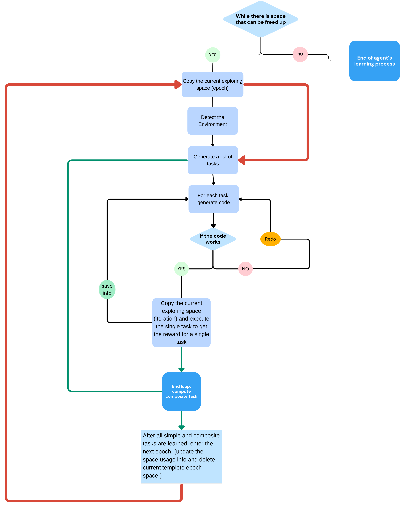
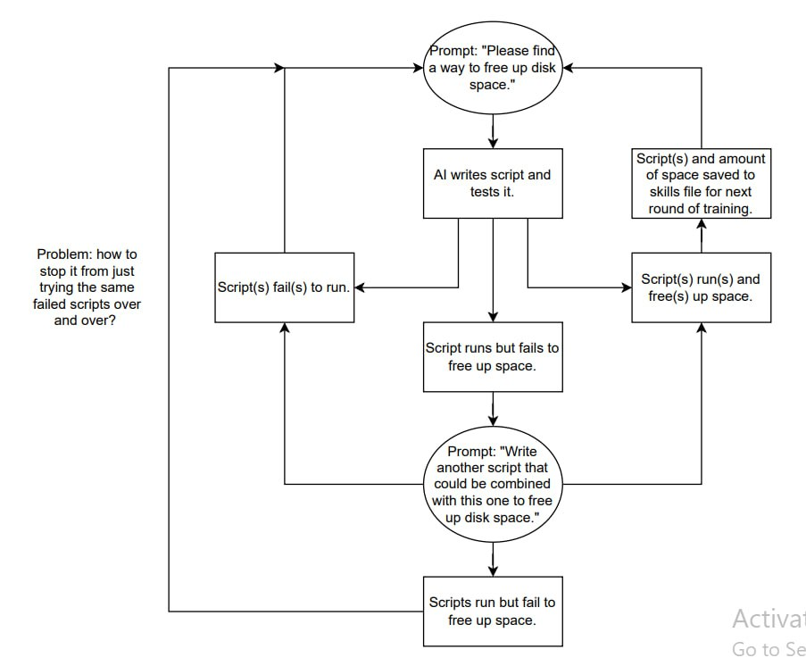

# Negative Space Learning (NSL)

Code for **Negative-Space Learning**: training a coding agent to improve using only the physical,
measurable consequences of its own actions — no reward model, no human labels, no other model
grading its output.

The agent lives inside a network of disposable Linux containers whose only job is to find and
free disk space without breaking the container it depends on. There is no semantic reward
anywhere in the loop by design: a run either measurably freed space or it didn't. Selection
happens through that single, hard-to-fake signal rather than through a learned reward.

Full method and results: **[Survival is the Only Reward](https://arxiv.org/abs/2601.12310)**.

## How it works

**Project flow**



**Chain-of-thought prompting**



Each run (`scripts/main.py`) drives the agent through three stages against a set of live
Docker containers:

1. **Special environment discovery** — the agent writes and runs code to explore the container
   beyond the basic `docker`/`df` stats already collected (e.g. what's actually in `/tmp`,
   `/var`, home directories).
2. **Strategy generation** — given the environment info, the agent proposes a list of candidate
   cleanup strategies; one is picked at random to execute.
3. **Strategy execution** — the agent generates code for the chosen strategy, runs it inside the
   container, and free disk space is measured before/after and averaged.

Every stage retries with self-correction (the model sees its own error and regenerates) up to a
configured `max_retries` before the run is abandoned. Every attempt — successful or not — is
logged as training data (prompt, raw response, extraction/validation/run result), so failed
attempts are as informative as successful ones.

Containers are built from a deliberately messy image (`docker/special-learn-compose`): three seed
archives (`documents.tar.gz`, `tmp.tar.gz`, `var.tar.gz`, containing junk files with deliberately
nonsensical names) are `ADD`ed into `/home/alice/`. Docker's `ADD` auto-extracts local tar
archives at the destination, so by the time `randomly_encrypt.sh` and `set_random_permissions.sh`
run in the next layers, the original `.tar.gz` filenames they check for (`[ -f "$file" ]`) are
very likely already gone — replaced by the extracted `documents/`, `tmp/`, `var/` directories —
which would make the "encryption" step a silent no-op, and would limit the permission-randomizing
script (a non-recursive `for file in *`) to the handful of top-level files in `/home/alice`
(the scripts themselves and `requirements.txt`) rather than the seeded content trees. This is
inferred from reading the Dockerfile and confirming the archives are valid gzip tarballs, not
from an actual build — worth confirming with a real build if you're relying on that step for
per-image variation. Either way, whatever variation these steps produce happens once at **image
build time** (`RUN` layers), not per container start, so containers booted from one built image
are identical to each other. Containers are still cheap to destroy and rebuild from a clean
image, which is what keeps the loop's iteration speed independent of human babysitting.

The variation that actually matters for bulk data collection comes from a different layer:
`scripts/data_collector.py` wipes `/tmp`, `/var/cache`, `/var/log` and a few home-directory junk
paths before each iteration and repopulates them from one of five fixed file-mix templates
(cycled by iteration number), then independently re-scans known junk locations before and after
the agent runs to compute how much of that self-created, ground-truth-known mess actually got
cleaned. A run is sorted into `success_full_run` or `failed_full_run` purely by whether
`actual_cleaned_kb_total > 0` — confirming the "no semantic reward, only a measured physical
consequence" framing above at the level that's actually used to build training data, independent
of whatever the base image's build-time steps do or don't do.

> **Note:** these images intentionally ship with root/passwordless SSH login and other relaxed
> settings so the agent has something realistic to fix — they're built for isolated,
> disposable sandboxes only and must never be exposed to an untrusted network.

## Repo layout

```
config/                 App config (TOML) — model backend, container ids, retry counts
docker/special-learn-compose/  Docker Compose + Alpine image defining the messy sandbox
docs/                   Diagrams referenced in this README
scripts/
  main.py               Single end-to-end run: explore -> propose strategies -> execute -> measure
  data_collector.py      Bulk SFT collection: wipes+repopulates containers each iteration from 5 fixed
                          junk templates, runs main.py per iteration, independently measures actual KB
                          freed, and sorts full run logs into success_full_run/failed_full_run by that
  DPO_data_collector.py  Same collection loop as above, plus GPU health checks, kept for DPO pairing
  create_DPO_dataset.py  Builds chosen/rejected preference pairs from collected run logs
  train_DPO.py           LoRA + DPO fine-tuning (via peft/trl) on the preference dataset
  unweighteddeltas.py    Generation-over-generation z-scored improvement analysis
src/
  agent.py               Prompt-building + LLM call wrappers for each pipeline stage
  meta.py, prompt.py      Prompt templates and system prompt
  helper.py               Run id / repo version / misc utilities
  genner/                 Pluggable LLM backends: Ollama Qwen, vLLM (OpenAI-compatible), Dream.
                          `QwenPeftConfig` exists in genner/config but isn't wired to any genner
                          class or to `get_genner`
  tool/code.py             Offline code validation (AST parse + compile check) before running in-container
  tool/docker.py           Container lifecycle + free-space measurement (host- and container-side)
  typing/                  Pydantic config schema + TypedDicts for each stage's training data
```

## Setup

Requires Python >= 3.10 and a running Docker daemon. Dependencies are managed with
[uv](https://github.com/astral-sh/uv):

```bash
uv sync
```

Bring up the sandbox containers:

```bash
cd docker/special-learn-compose
docker compose up -d --build
```

Configure the run in `config/config-container.toml` — model backend (`model_name`), which
containers to target (`container_ids`), retry limits per stage, and where to write generated
training data (`train_data_save_folder`). Model backends are selected by name in `get_genner`
(`src/genner/__init__.py`): `qwen` (Ollama), `vllm` (any OpenAI-compatible server, e.g. a local
vLLM server), `dream`.

## Usage

Run a single exploration/strategy/execution cycle:

```bash
uv run python scripts/main.py [path/to/config.toml]   # defaults to config/config-container.toml
```

Collect data in bulk toward a target row count (used to build the SFT training sets fed back into
each generation's fine-tune):

```bash
uv run python scripts/data_collector.py --target 20000 [--test] [--completions N]
```

Collect paired successful/failed runs for preference-based training:

```bash
uv run python scripts/DPO_data_collector.py --target 20000 [--test] [--completions N] [--no-gpu-check] [--vllm-port 8000]
```

Turn collected run logs into a DPO preference dataset:

```bash
uv run python scripts/create_DPO_dataset.py \
  --success-folder path/to/success_full_run \
  --failed-folder path/to/failed_full_run \
  --output dpo_dataset.jsonl \
  [--min-efficiency-diff 1.0] [--max-pairs 4500] [--similarity-threshold 0.8]
```

Fine-tune with LoRA + DPO on the resulting dataset. There's no CLI here — `MODEL_NAME`,
`DATA_PATH`, and `OUTPUT_DIR` are hardcoded placeholder constants at the top of `main()`
(`/Your-dataset-path/...`, `/Output-path/...`), so edit those in the script before running:

```bash
uv run python scripts/train_DPO.py
```

`scripts/unweighteddeltas.py` is a standalone analysis script, not a CLI tool — it hardcodes its
input (`ThereseStats.xlsx`, expected in the working directory) and output
(`therese_unweighted_deltas_analysis.xlsx`) filenames, so treat it as a template to copy/adapt
rather than something to run as-is. Given a spreadsheet of per-generation metrics (success rate,
% space freed, avg space per iteration, hours to collect a batch), it z-scores the
generation-over-generation change in each metric and combines them into a single improvement
score — the composite metric used to compare training lineages in the paper.

## Training regimes

The paper runs three parallel lineages of the same base model, differing only in which past
generations' data feed each retraining round: **Terese** (full accumulation — every successful
run from every prior generation), **Miri** (most-recent-3 generations only), and **Katalin**
(best-performing-3 generations regardless of recency). Recency windowing (Miri) turns out to be
the most stable choice over many generations — Terese peaks then declines, Katalin collapses
outright. See the paper for the full results and the reasoning behind each stage of this
pipeline.

## Citation

```bibtex
@misc{dodgson2026survival,
  title         = {Survival is the Only Reward: Sustainable Self-Training Through Environment-Mediated Selection},
  author        = {Dodgson, Jennifer and Alhajir, Alfath Daryl and Joedhitya, Michael and Pattirane, Akira Rafhael Janson and Kumar, Surender Suresh and Lim, Joseph and Peh, C.H. and Ramdas, Adith and Zhexu, Steven Zhang},
  year          = {2026},
  eprint        = {2601.12310},
  archivePrefix = {arXiv},
  primaryClass  = {cs.AI},
  url           = {https://arxiv.org/abs/2601.12310}
}
```
